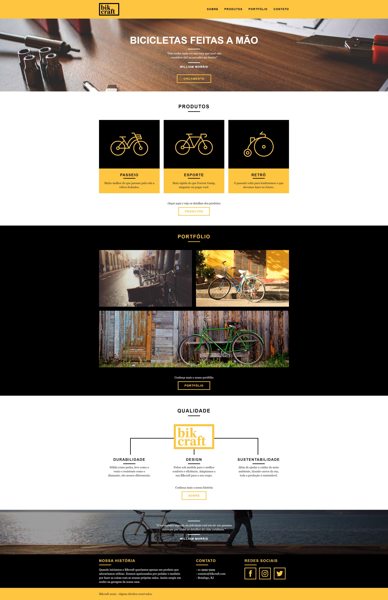

# Projeto Bikcraft
### O projeto Bikcraft foi criado do zero no curso de Web Design completo da Origamid.

Passando pelo Design feito no figma: Cores, Tipografias, Wireframe e Design;

Até o código: HTML, CSS, Javascript e PHP.

Foi utilizado neste curso no css tecnicas de posicionamento como o Grid Layout, e também foi utilizado um pouco de PHP para envio de formulários com auxílio de algumas ferramentas externas para criar um sendmail para os formulários presentes no site.

Nesse curso também foi ensinado conceitos de SEO e Head, também como implementar Analytics e subir o site em um domínio.

# Imagens do Resultado:

## Home:

